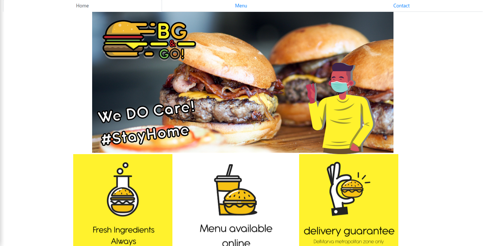
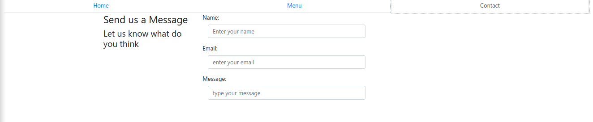
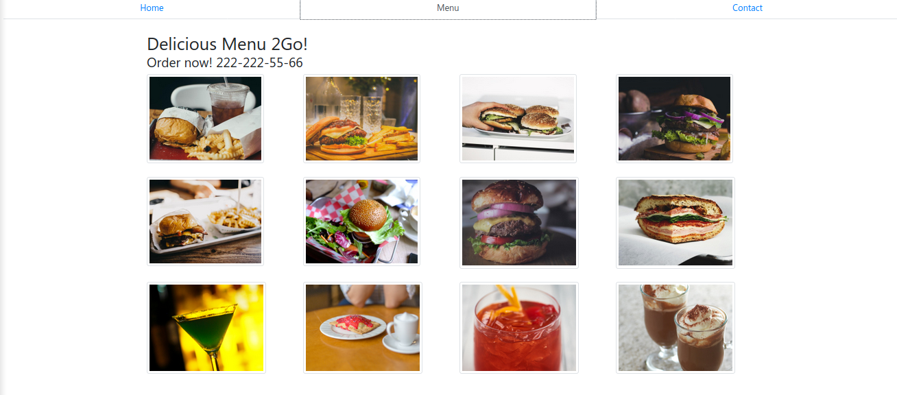

> Updated Version 1.1
 

 

 <h3 align="center">Burger&Go!: ES6 Webpack generated WebPage </h3>

 

   A full JavaScript webpack generated WebPage for a restaurant using Bootstrap and module programming
    
   <a href="https://www.theodinproject.com/courses/javascript/lessons/restaurant-page"><strong> Project Specs »</strong></a>
    
    
 

<!-- TABLE OF CONTENTS -->
## Table of Contents

* [About the Project](#about-the-project)
* [Live Demo](#live-demo)
* [How to run](#how-to-run)
* [Features](#features)
* [Screenshots](#screenshots)
* [Built With](#built-with)
* [Contact](#contact)

## About The Project

this page was dinamically generated from JS files bundled used Webpack, everything is being split into modules for making it more understandable

## Live Demo

* [Burger&Go!](https://raw.githubusercontent.com/Usagib/js-restaurant/tree/development/dist)

### How to run

- Prerequisites

You can acess the live demo or:
- Fork or clone this repository
- run > npm install
- run > npm run build
- opne ./dist/index.html in your browser

### Features

* Static generated Webpage

### Screenshots
Home

Contact

Menu

## Built With
Project built in Ruby on Rails
* CSS3
* ES6
* [Webpack](https://webpack.js.org/)

Additional packages used
* Bootstrap v4.0
* [file-loader](https://webpack.js.org/loaders/file-loader/)
* [style-loader](https://webpack.js.org/loaders/style-loader/)
* [css-loader](https://webpack.js.org/loaders/css-loader/)
* [webpack](https://webpack.js.org/)

## Contact

Eduardo Bonilla Github [https://github.com/UsagiB](https://github.com/UsagiB)
Eduardo Bonilla Portfolio [Usagib.github.io](http://usagib.github.io)

## Show your support

Give a ⭐️ if you like this project!
